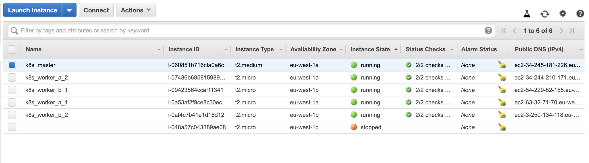
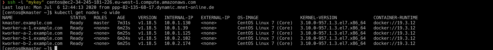

## Overview
Building kubernetes manually on ec2 instances on different availability zones

## Requirements
* AWS credentials
* S3 bucket (optional)

## Manual run 
```
terraform apply -auto-approve
var.AWS_ACCESS_KEY
  Enter a value: ***********************

var.AWS_SECRET_KEY
  Enter a value: *****************************************
```
## Building the cluster
```bash
terraform apply -auto-approve
```

## Final status
EC2 nodes on AWS console
 
Kubernetes cluster nodes


## Destorying the cluster
```bash
terraform apply -auto-approve
```

## Setup Bucket
You will need to create a bucket and reference the bucket name in the following section of `main.tf`:

```
terraform {
  backend "s3" {
    bucket = "terraform-bucket-moaaz"
    key    = "terraform.tfstate"
    region = "us-east-1"
  }
}
```