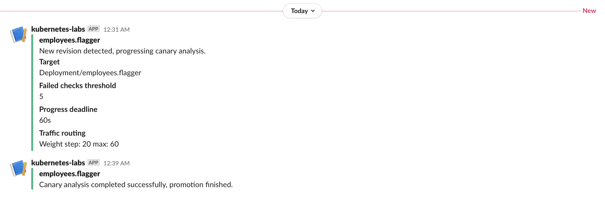

## Prerequisites
1. Kuberentes cluster 
2. Istio as service mesh 
   
### installing flagger 
```bash
kubectl apply -k github.com/weaveworks/flagger/kustomize/istio
```

### set the prerequisites
```bash
find . -iname k8s-ns.yaml| xargs kubectl apply -f
kubectl label namespace flagger istio-injection=enabled
kubectl config set-context --current --namespace=flagger
# kubectl apply -f . --recursive
```

### Main DB
```bash
find . -iname db-configmap.yaml | xargs kubectl apply -f
find . -iname db-secrets.yaml | xargs kubectl apply -f
find . -iname db-deploy.yaml | xargs kubectl apply -f
find . -iname db-svc.yaml | xargs kubectl apply -f
```

### version DB
```bash
find . -iname version-db-configmap.yaml | xargs kubectl apply -f
find . -iname version-db-deploy.yaml | xargs kubectl apply -f
find . -iname version-db-svc.yaml | xargs kubectl apply -f
```

### Version application
```bash
find . -iname version-setup-v1.yaml | xargs kubectl apply -f
find . -iname version-setup-v2.yaml | xargs kubectl apply -f
find . -iname version-setup-v3.yaml | xargs kubectl apply -f
find . -iname version-svc.yaml | xargs kubectl apply -f
find . -iname version-configmap.yaml | xargs kubectl apply -f
find . -iname version-secret.yaml | xargs kubectl apply -f
```


### Employees application
```bash
find . -iname emp-configmap.yaml | xargs kubectl apply -f
find . -iname emp-secrets.yaml | xargs kubectl apply -f
find . -iname emp-gateway.yaml | xargs kubectl apply -f
find . -iname emp-deployment-v1.yaml | xargs kubectl apply -f
find . -iname emp-hpa.yaml | xargs kubectl apply -f
```

### apply new release v2 to test automated-canary with flagger
```bash
find . -iname emp-flagger-alerting.yaml | xargs kubectl apply -f
find . -iname slack-alerting.yaml | xargs kubectl apply -f
find . -iname emp-deployment-v2.yaml | xargs kubectl apply -f
```
flagger switched 20% of the traffic to the new version of the application v2 

flagger switched 100% of the traffic to the new version fo the application v2 after making sure that there is no errors of certian types are 
 
flagger send a notification message to slack channel that deployment is completed successfully
 


### access application via below APIs
```
>> http://IP/welcome 
>> http://IP/api/register
>> http://IP/api/details/[employee_first_name]
>> http://IP/api/health
>> http://IP/api/info 
>> http://IP//api/hostname 
```

### Exporting istio external/public IP address
```bash
export IP=$(kubectl get svc istio-ingressgateway -n istio-system -o jsonpath='{.status.loadBalancer.ingress[0].ip}')
# send traffic to application apis 
siege -c 10 -t 10m http://$IP/api/details/moaaz
# or
while true; do curl -s -o /dev/null http://35.233.11.47/api/details/info && sleep 1 ; done 
```

### additionally you can setup granfa-flagger helm chart to k8s cluster
```bash
helm upgrade -i flagger-grafana flagger/grafana --namespace=istio-system --set url=http://prometheus:9090
```