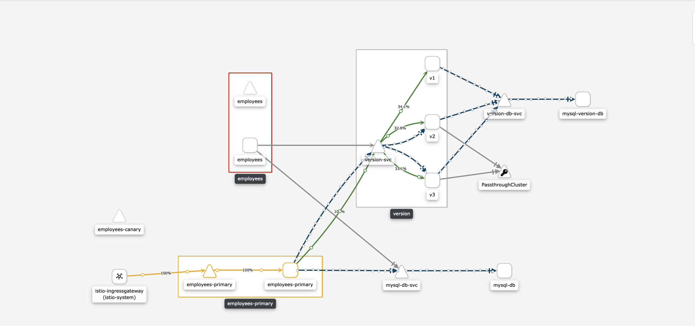

## Summary
#### I did write this python/flask application which is supposed to give you the opportunity to register and preview basic details about new employee, the application stores the data in MYSQL DB as backend as well it connects to other microserviece using API and retreive version data too. 

## Prerequisites
1. Kuberentes cluster 
2. Istio as service mesh 

## Installing istio
1. Download the helm chart package 
```bash 
curl -L https://git.io/getLatestIstio | sh -
cd istio-1.0.6
```
2. Install namespace for setting up istio 
```bash
kubectl create ns istio-system
helm template install/kubernetes/helm/istio-init --namespace istio-system | kubectl apply -f -
helm template install/kubernetes/helm/istio --namespace istio-system | kubectl apply -f -
```
3. Configure kaili username and password (optional)
```bash
# insert username for KAILI 
KIALI_USERNAME=$(read -p 'Kiali Username: ' uval && echo -n $uval | base64)
# insert password for KAILI 
KIALI_PASSPHRASE=$(read -sp 'Kiali Passphrase: ' pval && echo -n $pval | base64)
NAMESPACE=istio-system
# create secrect
cat <<EOF | kubectl apply -f -
apiVersion: v1
kind: Secret
metadata:
  name: kiali
  namespace: $NAMESPACE
  labels:
    app: kiali
type: Opaque
data:
  username: YWRtaW4=
  passphrase: YWRtaW4=
EOF
```
4. Setup istio and enable prometheus , grafana , kaili and jaeger  
```bash 
helm template install/kubernetes/helm/istio --set grafana.enabled=true --set kiali.enabled=true --set "values.kiali.dashboard.grafanaURL=http://grafana:3000" --set "values.kiali.dashboard.jaegerURL=http://jaeger-query:16686" --namespace istio-system | kubectl apply -f -
```
5. Enable iostio for certain namespace 
```bash
# enable istio injection for the default namespace
kubectl label namespace default istio-injection=enabled
```
6. Access different grafana via enabling port forwarding ( optional )
```bash
# Port forwarding to grafana service
kubectl -n istio-system port-forward $(kubectl -n istio-system get pod -l app=grafana -o jsonpath='{.items[0].metadata.name}') 3000:3000 &
```
7. Access different prometheus via enabling port forwarding ( optional )
```bash
# Port forwarding to prometheus service
kubectl -n istio-system port-forward $(kubectl -n istio-system get pod -l app=prometheus -o jsonpath='{.items[0].metadata.name}') 9090:9090 &
```
8. Access different kiali via enabling port forwarding ( optional )
```bash
# port forwarding to kiali service
kubectl -n istio-system port-forward $(kubectl -n istio-system get pod -l app=kiali -o jsonpath='{.items[0].metadata.name}') 20001:20001 &
```
9. Access different jaeger via enabling port forwarding ( optional )
```bash
kubectl port-forward -n istio-system $(kubectl get pod -n istio-system -l app=jaeger -o jsonpath='{.items[0].metadata.name}') 16686:16686 &
kubectl port-forward -n istio-system svc/jaeger-query 16686:16686  &
```

### Requirement for making it running and ready
- Kubernetes cluster either locally or on AWS or on GKE
- Run below command 
```bash
# deploy the chart for development environment 
helm install --generate-name  ./employees --set environment=development
# deploy the chart for production environment 
helm install --generate-name  ./employees --set environment=production
```

### Exporting istio external/public IP address
```bash
export IP=$(kubectl get svc istio-ingressgateway -n istio-system -o jsonpath='{.status.loadBalancer.ingress[0].ip}')
```

### access application via APIs
```
>> http://IP/welcome 
>> http://IP/api/register
>> http://IP/api/details/[employee_first_name]
>> http://IP/api/health
>> http://IP/api/info 
>> http://IP//api/hostname 
```
## Application architecture with canary deployment
 
## Application APIs 
http://IP/welcome 
 
http://IP/api/details/[employee_first_name]
 
 http://IP/api/health
 
http://IP/api/info 

http://IP/api/register


### My idea here is to build to show how the microservices works all together , plus integrating this with service mesh (istio) to acheive different deployment strategies like canary releases, blue/green deployment , traffic injection and mirroring and etcetera

### You can register a user by sending post request 
```
curl -X POST -H "Content-Type: application/json" -d '{
  "firstname": "Mark",
  "lastname": "lars",
  "department": "IT",
  "email": "mark.lars@gmail.com"
}' http://10.0.0.200/api/register
```

