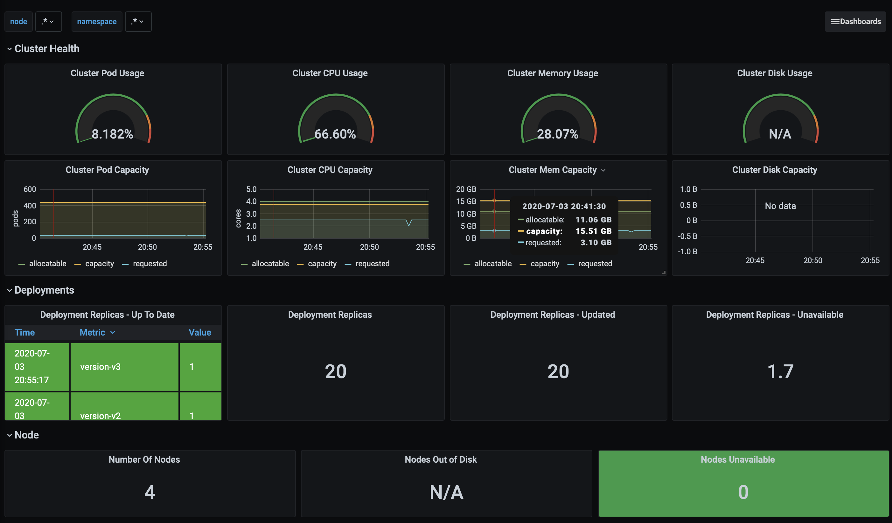
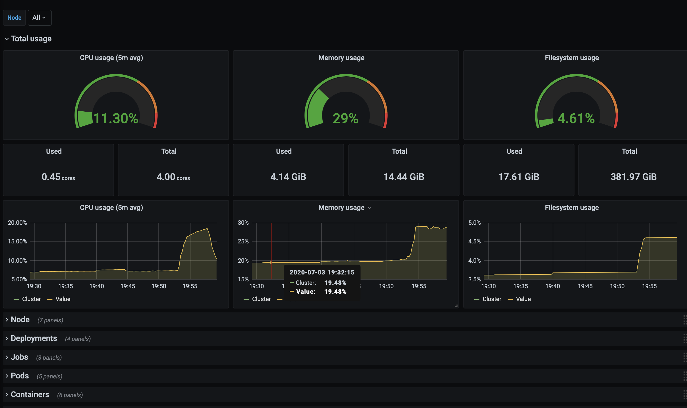
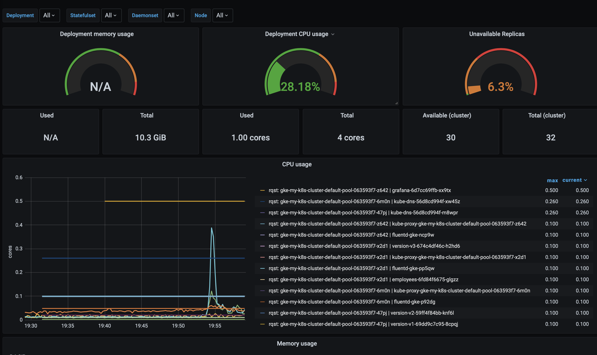
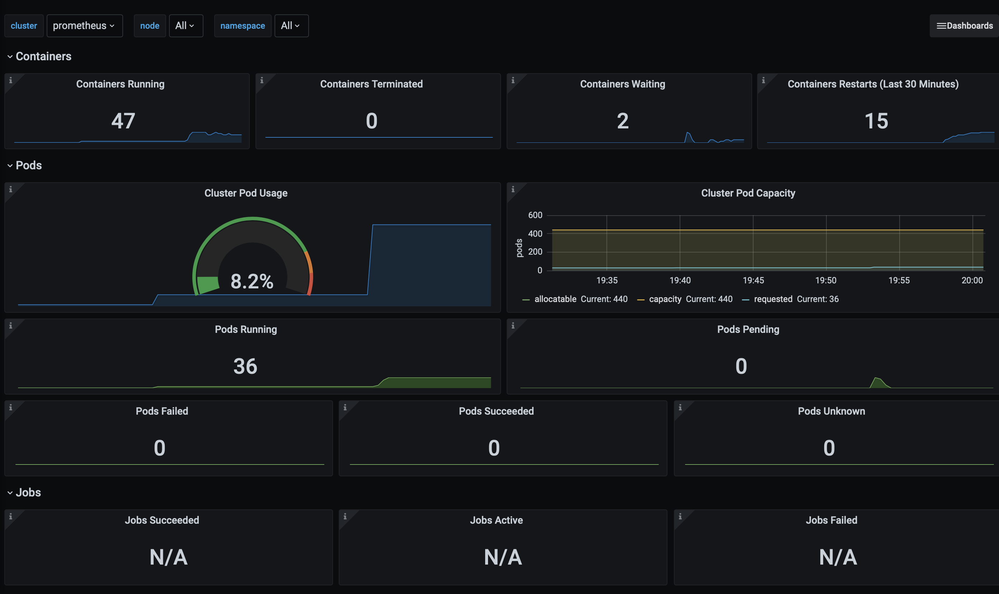
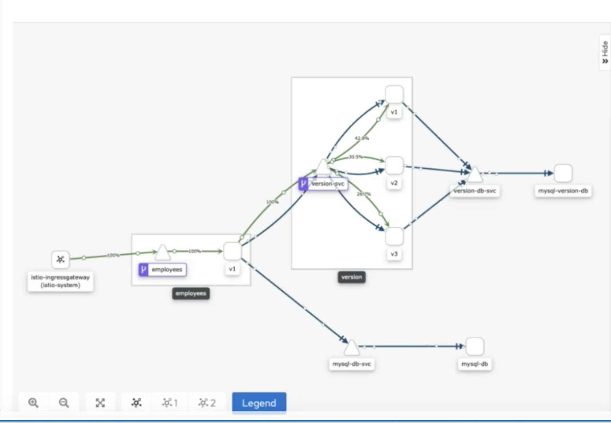
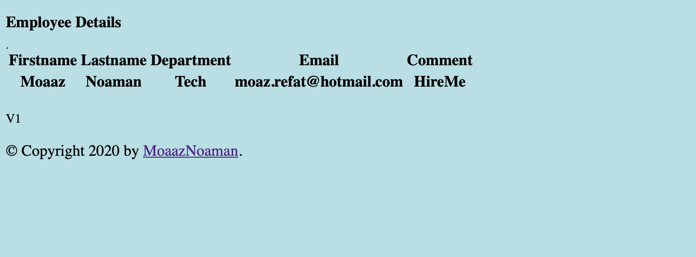
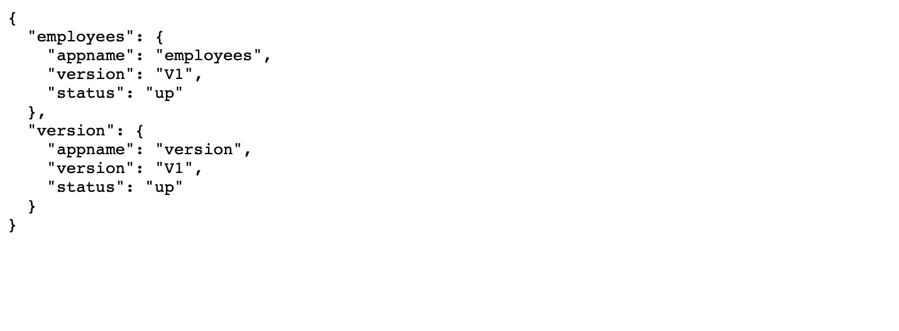
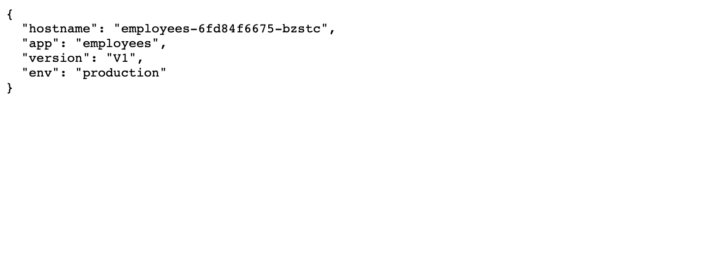
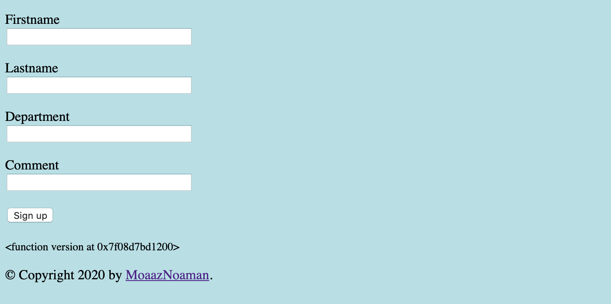

### Install ingress-nginx 
```bash
kubectl create ns nginx
helm install nginx stable/nginx-ingress --namespace nginx --set rbac.create=true --set controller.publishService.enabled=true
``` 

## Monitor kubernetes cluster with prometheus + kube-state-metric + grafana  
1. creating a role binding with cluster role cluster-admin
2. install prometheus to scrap the metrics 
3. install kube-state-metrics to enable extra metrics and expose it on /metrics 
4. install grafana to visualize the metrics and build monitors  
5. install my application charts using helm 
   
### 1. Create a cluster role binding with the account name in k8s cluster
```bash
ACCOUNT=$(gcloud info --format='value(config.account)')
kubectl create clusterrolebinding owner-cluster-admin-binding \
    --clusterrole cluster-admin \
    --user $ACCOUNT
```

### 2. Install prometheus  
```bash
# create a name space to install monitoring related pods,service, etc.
kubectl create namespace monitoring
# create a prometheus cluster role
kubectl apply -f task/k8s/prometheus/PrometheusClusterRole.yaml
# create a prometheus config map
kubectl apply -f task/k8s/prometheus/PrometheusConfigmap.yaml
# create a prometheus deployment 
kubectl apply -f task/k8s/prometheus/PrometheusDeployment.yaml
# list all created resources in monitoring name space
kubectl get deployments --namespace=monitoring
```
### Connect to prometheus
```bash
# port forwarding 
kubectl -n monitoring port-forward $(kubectl -n monitoring get pod -l app=prometheus-server -o jsonpath='{.items[0].metadata.name}') 8080:9090 &
# browse prometheus 
curl http://localhost:8080
# alternatively you can access it via service
kubectl apply -f prometheus/PrometheusService.yaml
```

### 3. Install Kube State Metrics
```bash
# create a cluster role 
kubectl apply -f task/k8s/kube-state-metrics/cluster-role.yaml
# create a cluster rolebinding 
kubectl apply -f task/k8s/kube-state-metrics/cluster-role-binding.yaml
# create a deployment 
kubectl apply -f task/k8s/kube-state-metrics/deployment.yaml
# create a service account
kubectl apply -f task/k8s/kube-state-metrics/service-account.yaml
# expose the service
kubectl apply -f task/k8s/kube-state-metrics/service.yaml
# get Kube State Metrics deployment
 kubectl get deployments kube-state-metrics -n kube-system
```

### 4. Install garafana
```bash
# create a datasource configration for grafana server
kubectl apply -f task/k8s/kube-state-metrics/grafana/grafana-datasource-config.yaml
# create grafana deplpyment 
kubectl apply -f task/k8s/kube-state-metrics/grafana/grafana-deployment.yam
```
### Connect to Grafana 
```bash
# port forwarding 
kubectl -n monitoring port-forward $(kubectl -n monitoring get pod -l app=grafana -o jsonpath='{.items[0].metadata.name}') 3000:3000 &
# browse prometheus 
curl http://localhost:8080
# alternatively you can access it via service
kubectl apply -f task/k8s/grafana/grafana-service.yaml
```
### this is sample monitoring for the cluster 

 
 


### 4. Install my application using helm chartchart 
#### this application consist of two main microservices main one ( employees ) other one is (version) both applications requires connect to DB backends which is MYSQL db containers
#### for final overview please have a look on below section "[applications architecture](https://github.com/moaaznoaman/k8s/tree/master/task#applications-architecture)"

#### Install kubernetes helm charts 
```bash
# here i assume different environments are build on same cluster but different name spaces 
# for development environment 
helm install --generate-name  ./k8s/employees --set environment=development  -f employees/envs/dev/values.yaml
# for production environment
helm install --generate-name  ./k8s/employees --set environment=production  -f employees/envs/prod/values.yaml
```
### Applications architecture


### Get external accesisble IP address
```bash 
export IP=$(kubectl get svc nginx-nginx-ingress-controller -n nginx -o jsonpath='{.status.loadBalancer.ingress[0].ip}')

# access application via
>> http://IP/welcome 
>> http://IP/api/details/[employee_first_name]
>> http://IP/api/health
>> http://IP/api/info 
>> http://IP//api/hostname 
>> http://IP/api/register
```
http://IP/welcome 
 
http://IP/api/details/[employee_first_name]
 
 http://IP/api/health
 
http://IP/api/info 

http://IP/api/register


### Send traffic to application APIs 
```bash
siege -c 10 -t 10m http://$(kubectl get svc nginx-nginx-ingress-controller -n nginx -o jsonpath='{.status.loadBalancer.ingress[0].ip}')/api/details/moaaz
```